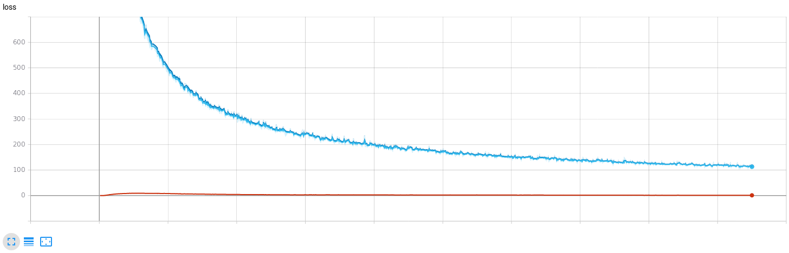
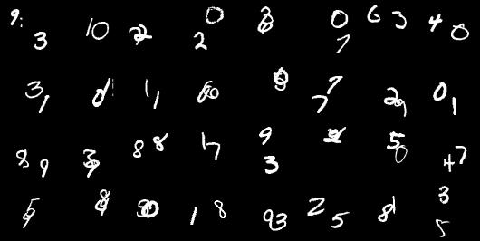
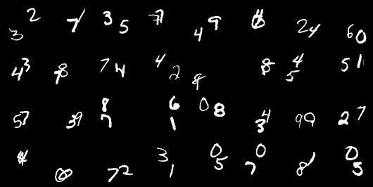

# SVP

This repository is reproducting of the [code](https://github.com/edenton/svg) for the paper [Stochastic Video Generation with a learned prior](https://arxiv.org/abs/1802.07687).

Experiments are done for moving mnist and stochastic moving mnist

# Requirments
- Python 3.6
- Pytorch 0.4.0

# ToDo
- [ ] MovingMnist Experiments Update

# Results 
### Moving MNIST
- Loss of Training

- Reconstruction results
  - original
 

  - reconstruction
 

- Generation results

  - original
 

  - reconstruction
 
 
### Stochastic Moving MNIST
 TBA...
